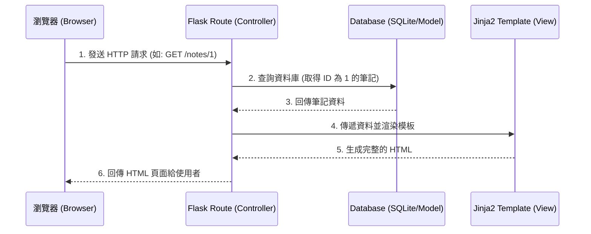

# 系統架構設計 (Architecture) - 讀書筆記本系統

## 1. 技術架構說明

**選用技術與原因**
- **後端框架：Python + Flask**
  - 原因：Flask 是一個輕量級的 Python Web 框架，適合中小型專案快速開發與雛形驗證。它的靈活性高，容易與各種資料庫套件結合，並且擁有豐富的社群資源。
- **模板引擎：Jinja2**
  - 原因：Flask 內建 Jinja2，可以方便地在 HTML 檔案中嵌入 Python 變數與邏輯（如 `if` 判斷、`for` 迴圈），負責伺服器端渲染 (SSR, Server-Side Rendering)。
- **資料庫：SQLite**
  - 原因：SQLite 是一個輕量級、基於檔案的資料庫系統，無需架設獨立的資料庫伺服器，非常適合本機開發與中小型規模的讀書筆記系統。

**Flask MVC 模式說明**
本專案採用典型的 MVC (Model-View-Controller) 架構模式來組織程式碼：
- **Model (模型)**：負責定義資料結構與資料庫互動邏輯（如：筆記、標籤、測驗紀錄等）。本專案直接將其對應到 SQLite 資料表與基礎操作。
- **View (視圖)**：負責呈現使用者介面。在本專案中，View 由 Jinja2 HTML 模板組成，負責將 Controller 傳遞過來的資料渲染成網頁。
- **Controller (控制器)**：負責接收使用者的請求 (HTTP Request)，執行相應的商業邏輯（如查詢資料庫），並回傳相對應的 View 或是導向其他頁面。在本專案中，由 Flask 的 Routes (路由) 擔任此角色。

## 2. 專案資料夾結構

以下是本專案的資料夾結構與各部分用途說明：

```text
web_app_development/
├── app/                      # 應用程式主目錄
│   ├── models/               # 資料庫模型 (Model) - 定義資料表與 Schema
│   │   └── schema.sql        # SQLite 的資料表建立語法
│   ├── routes/               # 路由與控制器 (Controller) - 處理各頁面的邏輯
│   │   ├── note_routes.py    # 筆記相關路由 (新增、編輯、檢視)
│   │   ├── review_routes.py  # 測驗與複習相關路由 (間隔重複、測驗模式)
│   │   └── main_routes.py    # 首頁與其他通用路由
│   ├── templates/            # HTML 模板檔案 (View) - 使用 Jinja2 語法
│   │   ├── base.html         # 共用模板 (包含導覽列、CSS/JS 引入)
│   │   ├── index.html        # 首頁 / 儀表板 (顯示推薦複習清單)
│   │   ├── note_edit.html    # 筆記編輯與新增頁面 (雙層筆記介面)
│   │   ├── note_view.html    # 筆記檢視頁面
│   │   └── quiz.html         # 自我測驗模式頁面
│   └── static/               # 靜態資源檔案
│       ├── css/              # 樣式表 (style.css)
│       └── js/               # 前端腳本 (如閃卡翻轉效果)
├── instance/                 # 存放環境特定檔案 (如資料庫)
│   └── database.db           # SQLite 資料庫檔案
├── docs/                     # 專案文件 (PRD, 架構圖等)
├── app.py                    # 程式進入點 - 初始化 Flask 應用程式與註冊路由
└── requirements.txt          # Python 依賴套件清單
```

## 3. 元件關係圖

以下展示使用者如何透過瀏覽器與系統互動的資料流：



## 4. 關鍵設計決策

1. **伺服器端渲染 (SSR) 而非前後端分離**
   - **原因**：考慮到專案規模與開發速度，採用 Flask + Jinja2 直接渲染 HTML，可以減少前後端 API 串接的複雜度，讓團隊能更快產出可運作的 MVP（最小可行性產品）。
2. **將路由模組化 (Modular Routing)**
   - **原因**：將 `routes` 依功能拆分為 `note_routes.py` 與 `review_routes.py` 等，而不是全部寫在 `app.py` 中。這樣能保持程式碼結構清晰，便於多人協作與後續維護。
3. **SQLite 作為主要資料庫**
   - **原因**：對於個人使用的讀書筆記系統，資料量不會過大。SQLite 不需要額外設定資料庫伺服器，降低了開發與部署的門檻。若未來有擴充需求，也可以輕鬆轉移至 PostgreSQL 或 MySQL。
4. **統一的基礎模板 (base.html)**
   - **原因**：利用 Jinja2 的模板繼承特性，將導覽列、頁尾與共用的 CSS/JS 統一放在 `base.html` 中。所有其他頁面只需繼承此模板，能確保全站 UI 風格一致，並減少重複的程式碼。
