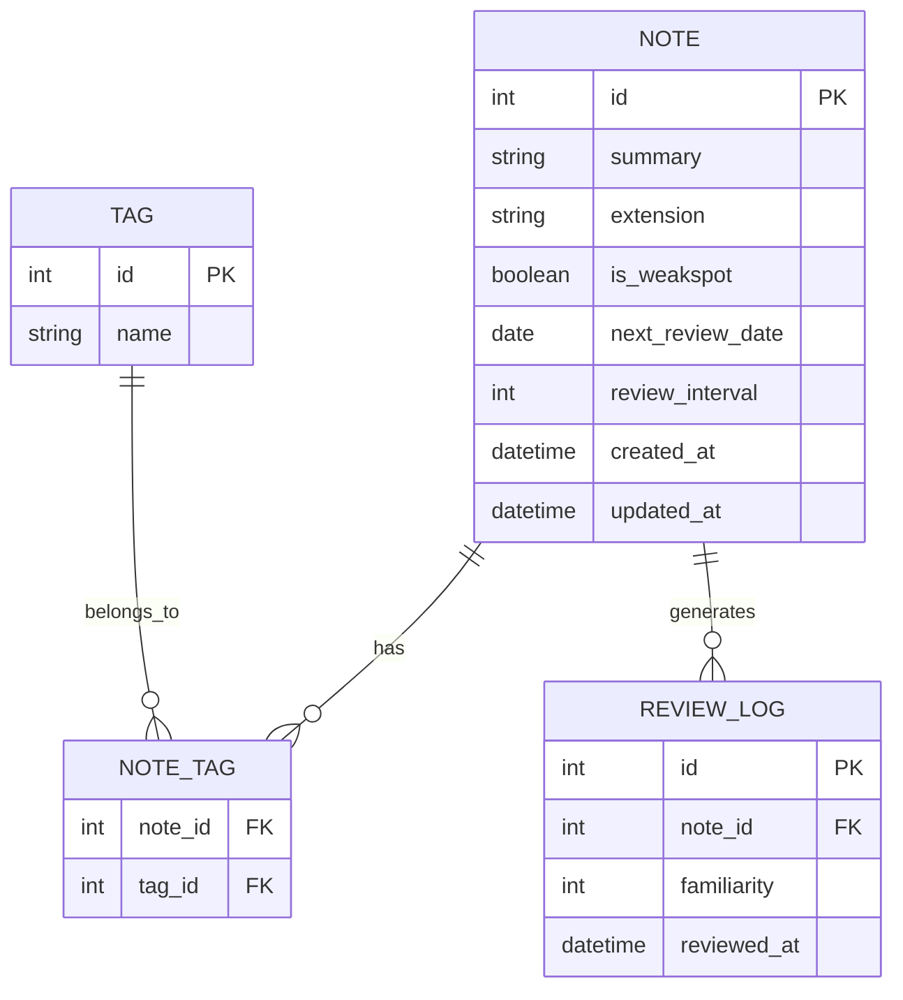

# 資料庫設計 (DB Design) - 讀書筆記本系統

## 1. ER 圖 (實體關係圖)

## 2. 資料表詳細說明

### `notes` (筆記表)
儲存筆記的核心內容與間隔重複的排程資料。
- `id` (INTEGER): 主鍵，自動遞增。
- `summary` (TEXT): 核心摘要，必填。
- `extension` (TEXT): 延伸思考與細節。
- `is_weakspot` (BOOLEAN): 盲點/錯題標記 (0=否, 1=是)，預設 0。
- `next_review_date` (DATE): 下次建議複習日期。
- `review_interval` (INTEGER): 目前的複習間隔（天數），預設 0。
- `created_at` (DATETIME): 建立時間。
- `updated_at` (DATETIME): 最後更新時間。

### `tags` (標籤表)
儲存所有的標籤與主題分類。
- `id` (INTEGER): 主鍵，自動遞增。
- `name` (TEXT): 標籤名稱，必填且唯一。

### `note_tags` (筆記與標籤關聯表)
處理多對多關係（一篇筆記有多個標籤，一個標籤有多篇筆記）。
- `note_id` (INTEGER): 外鍵，對應 `notes.id`。
- `tag_id` (INTEGER): 外鍵，對應 `tags.id`。
- Primary Key 為 (`note_id`, `tag_id`)。

### `review_logs` (複習紀錄表)
記錄每次自我測驗的結果，用於統計與除錯。
- `id` (INTEGER): 主鍵，自動遞增。
- `note_id` (INTEGER): 外鍵，對應 `notes.id`。
- `familiarity` (INTEGER): 熟悉度評分 (例如 1=答錯/不熟, 2=普通, 3=非常熟悉)。
- `reviewed_at` (DATETIME): 複習時間。

## 3. SQL 建表語法
存放於 `database/schema.sql`。

## 4. Python Model 程式碼
存放於 `app/models/` 目錄下：
- `app/models/note.py`: 處理 `notes` 表的 CRUD 操作與間隔重複邏輯。
- `app/models/tag.py`: 處理 `tags` 與 `note_tags` 的相關操作。
