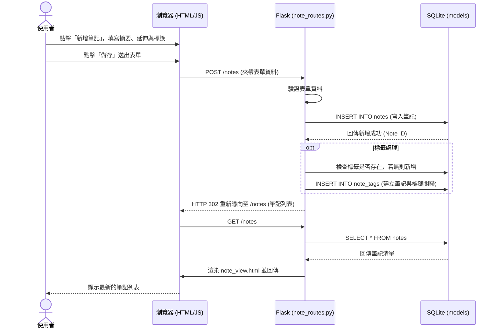

# 流程圖設計 (Flowchart) - 讀書筆記本系統

## 1. 使用者流程圖 (User Flow)

此流程圖展示使用者進入系統後的各種操作路徑，涵蓋核心的筆記管理、標籤分類與測驗複習功能。

```mermaid
flowchart LR
    A([使用者開啟網頁]) --> B[首頁 - 儀表板 Dashboard]
    
    B --> C{要執行什麼操作？}
    
    C -->|新增/編輯筆記| D[筆記編輯頁]
    D --> D1[填寫核心摘要與延伸思考]
    D --> D2[設定標籤與主題]
    D1 & D2 --> D3([儲存並返回列表/首頁])
    
    C -->|瀏覽筆記| E[筆記列表/搜尋頁]
    E --> E1[點擊特定筆記]
    E1 --> E2[筆記檢視頁]
    E2 --> E3{操作}
    E3 -->|編輯| D
    E3 -->|刪除| E4([刪除並返回列表])
    
    C -->|開始複習| F[間隔重複/推薦複習清單]
    F --> G[自我測驗模式 (閃卡)]
    G --> G1[思考並翻轉看答案]
    G1 --> G2{熟悉度評估}
    G2 -->|不熟/答錯| G3[記錄為盲點/錯題]
    G2 -->|熟悉| G4[更新間隔重複排程]
    G3 & G4 --> G5([繼續下一題或結束])
```

## 2. 系統序列圖 (Sequence Diagram)

此圖以「使用者新增一篇筆記並儲存」為例，展示資料如何在系統各元件之間流動。



## 3. 功能清單對照表

以下是本專案主要功能與對應的路由設計（URL 路徑與 HTTP 方法）：

| 功能名稱 | URL 路徑 | HTTP 方法 | 說明 |
| --- | --- | --- | --- |
| **首頁/儀表板** | `/` | GET | 顯示推薦複習清單與系統概況 |
| **筆記列表** | `/notes` | GET | 顯示所有筆記，支援標籤/主題過濾 |
| **新增筆記介面** | `/notes/new` | GET | 顯示新增雙層筆記的表單 |
| **儲存新筆記** | `/notes` | POST | 接收表單資料並寫入資料庫 |
| **檢視單一筆記** | `/notes/<id>` | GET | 顯示特定筆記的完整內容 |
| **編輯筆記介面** | `/notes/<id>/edit` | GET | 顯示編輯筆記的表單（帶入原資料） |
| **更新筆記** | `/notes/<id>/edit` | POST | 接收更新後的資料並寫入資料庫 |
| **刪除筆記** | `/notes/<id>/delete` | POST | 刪除特定筆記（使用 POST 確保安全） |
| **標籤列表/管理**| `/tags` | GET | 顯示所有標籤與主題 |
| **錯題/盲點清單**| `/review/weakspots` | GET | 篩選出被標記為不熟的筆記 |
| **測驗模式** | `/review/quiz` | GET | 載入自我測驗（閃卡）頁面與題目 |
| **提交測驗結果** | `/review/quiz/submit`| POST | 記錄使用者的熟悉度，更新間隔重複排程 |
